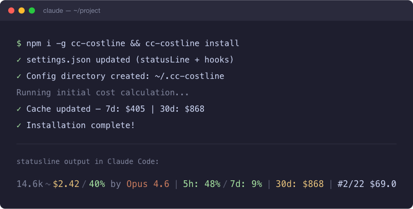

[English](README.md) | [中文](README.zh-CN.md)

# cc-zhipu-hud

<p align="center">
  
</p>

<p align="center">
  <strong>Enhanced statusline for Claude Code with Zhipu AI / GLM balance tracking.</strong>
</p>

<p align="center">
  <a href="https://www.npmjs.com/package/cc-zhipu-hud"></a>
  <a href="LICENSE"></a>
  <a href="https://nodejs.org/"></a>
</p>

---

**cc-zhipu-hud** replaces Claude Code's default statusline with a rich heads-up display showing context usage, token consumption, API costs, and — for Zhipu AI / GLM users — real-time Coding Plan quota and token balance.

Forked from [cc-costline](https://github.com/Ventuss-OvO/cc-costline) and extended with deep Zhipu platform integration.

## Features

```
[Opus 4.6 (1M)] │ cc-zhipu-hud │ git:(main)
Context ░░░░░░░░░░ 45% │ 5h:████░░░░ 40% │ 7d:██░░░░░░ 20%
```

### Statusline modules

| Module | Example | Description |
|--------|---------|-------------|
| **Model** | `[Opus 4.6 (1M)]` | Current model (auto-shortened display name) |
| **Project** | `cc-zhipu-hud` | Working directory name |
| **Git** | `git:(main)*` | Current branch (`*` = uncommitted changes) |
| **Context** | `░░░░░░░░░░ 45%` | Context window usage with progress bar |
| **5h usage** | `5h:████░░░░ 40%` | 5-hour rolling limit usage |
| **7d usage** | `7d:██░░░░░░ 20%` | 7-day cumulative usage |
| **Balance** | `¥142.50` | Remaining token balance (Zhipu AI mode) |
| **Leaderboard** | `#2/22 $67.0` | [ccclub](https://github.com/mazzzystar/ccclub) ranking |

### Smart API detection

No manual config needed — the HUD inspects `ANTHROPIC_BASE_URL` at startup:

- **Zhipu AI proxy** (`*.bigmodel.cn`) → Shows GLM Coding Plan quota + token balance
- **Official Anthropic API** → Shows Claude usage limits with OAuth token refresh

### Color rules

- **Context & usage**: green (<60%) → orange (60–79%) → red (≥80%)
- **Leaderboard**: #1 gold, #2 white, #3 orange, others cyan

### Reliable caching

All external API data is cached under `/tmp/sl-*` with intelligent retry:

- **Local costs**: 2-minute TTL (refreshes immediately if newer transcripts exist)
- **API quotas**: 5-minute retry throttle (stale data never overwritten on failure)
- **Token-aware**: OAuth token rotation triggers instant refresh

## Prerequisites

| You must have | Why |
|---------------|-----|
| **Claude Code** | Host application — no statusline without it |
| **Node.js ≥ 22** | Runtime requirement (see `package.json` → `engines`) |
| **`curl` on PATH** | API requests use `curl` (quota, usage, leaderboard) |
| **Outbound network** | Zhipu / Anthropic endpoints must be reachable |
| **`ANTHROPIC_AUTH_TOKEN`** | Required for usage/balance refresh in either mode |

**Optional:** Install [ccclub](https://github.com/mazzzystar/ccclub) for leaderboard rankings.

## Installation

### Quick install (npm)

```bash
npm i -g cc-zhipu-hud && cc-zhipu-hud install
```

Then start a **new** Claude Code session.

### From source

```bash
git clone https://github.com/beiyuii/cc-zhipu-hud.git
cd cc-zhipu-hud
npm install && npm run build
npm link
cc-zhipu-hud install
```

### Install as a Claude Code Plugin

You can also install this as a plugin via Claude Code's `/plugin` command:

1. Add the marketplace:
   ```
   /plugin marketplace add beiyuii/cc-zhipu-hud
   ```
2. Install the plugin:
   ```
   /plugin install cc-zhipu-hud
   ```

## Configuration

### Zhipu AI users

Set these in `~/.claude/settings.json`:

```json
{
  "env": {
    "ANTHROPIC_AUTH_TOKEN": "your-zhipu-api-key",
    "ANTHROPIC_BASE_URL": "https://open.bigmodel.cn/api/anthropic"
  }
}
```

The HUD automatically detects the Zhipu proxy and shows your GLM Coding Plan quota and token balance.

### Official Claude API users

No extra config needed — Claude Code manages the OAuth token automatically. You'll see Claude usage limits in the statusline.

### Cost tracking period

```bash
cc-zhipu-hud config --period 7d    # Last 7 days (default)
cc-zhipu-hud config --period 30d   # Last 30 days
cc-zhipu-hud config --period both  # Show both periods
```

## Commands

```bash
cc-zhipu-hud install          # Register with Claude Code settings
cc-zhipu-hud uninstall        # Remove from settings
cc-zhipu-hud config --period  # View / change cost period
cc-zhipu-hud refresh          # Recalculate local cost cache
```

## How it works

```
┌─────────────┐     render (stdin JSON)     ┌──────────────┐
│  Claude Code │ ──────────────────────────> │ cc-zhipu-hud │
│   (every     │                             │   statusline  │
│    turn)     │ <────────────────────────── │   renderer    │
└─────────────┘     formatted statusline     └──────┬───────┘
                                                    │
                    ┌───────────────────────────────┼───────────────┐
                    │                               │               │
                    ▼                               ▼               ▼
            ┌─────────────┐               ┌──────────────┐ ┌────────────┐
            │ Local costs │               │ Zhipu quota  │ │ Claude     │
            │ (~/...jsonl)│               │ (bigmodel.cn)│ │ usage API  │
            └─────────────┘               └──────────────┘ └────────────┘
                    │                               │               │
                    └───────────────────────────────┼───────────────┘
                                                    ▼
                                           ┌────────────────┐
                                           │  /tmp/sl-*     │
                                           │  (TTL cache)   │
                                           └────────────────┘
```

1. Claude Code calls `cc-zhipu-hud render` on every turn, piping session JSON via stdin
2. `render()` reads stdin for session metadata (cost, model, context %) and the transcript for token count
3. Three data sources are refreshed inline with independent TTLs:
   - **Local cost**: `collectCosts()` scans all `.jsonl` files under `~/.claude/projects/` (2-min TTL)
   - **Zhipu quota**: `getGlmCodingPlanUsage()` fetches 5h/weekly limits from `open.bigmodel.cn` (5-min retry)
   - **Zhipu balance**: `getZhipuBalance()` fetches token packages from `bigmodel.cn/api/biz/tokenAccounts` (5-min retry)
   - **Claude usage**: Fetches from `api.anthropic.com/api/oauth/usage` (5-min retry, OAuth token-aware)
   - **ccclub rank**: Fetches from `ccclub.dev/api/rank` if installed (5-min retry)
4. On session end, the `SessionEnd` hook fires `cc-zhipu-hud refresh` to warm the cost cache

## Development

```bash
npm install          # Install dependencies
npm run build        # Compile TypeScript (→ dist/)
npm test             # Build + run 63 unit tests
npm link             # Symlink for local testing
```

### Project structure

```
src/
├── cli.ts          # CLI entry (install, uninstall, config, refresh, render)
├── statusline.ts   # Render logic with unified TTL-cached data refresh
├── collector.ts    # Scan ~/.claude/projects/**/*.jsonl for token stats
├── calculator.ts   # Per-model pricing lookup and cost calculation
├── cache.ts        # Cache/config read/write (~/.cc-zhipu-hud/)
└── zhipu.ts        # Zhipu AI balance + GLM Coding Plan quota fetching
test/
├── statusline.test.ts   # Formatting, color, countdown functions
├── calculator.test.ts   # Pricing lookup, cost calculation
├── cache.test.ts        # Cache/config roundtrip, edge cases
├── collector.test.ts    # Cost collection with mock jsonl data
└── render.test.ts       # Render output format, ANSI colors
```

### Testing

63 tests across 5 files (~79% line coverage, ~89% function coverage) using `node:test` + `node:assert/strict`.

## Roadmap

- [ ] Multi-token-cost GLM model pricing tiers
- [ ] Configurable balance / cost threshold alerts
- [ ] Windows / Linux keychain support for credentials
- [ ] Custom API endpoint support
- [ ] More language translations

## Contributing

Issues and pull requests are welcome. Before submitting a PR, please:

1. Run `npm test` and ensure all tests pass
2. Keep the zero-runtime-dependency constraint
3. Make formatting / color functions pure and tested

## Acknowledgments

- [cc-costline](https://github.com/Ventuss-OvO/cc-costline) by Ventuss — original Claude Code statusline project
- [ccclub](https://github.com/mazzzystar/ccclub) by 碎瓜 — Claude Code cost leaderboard
- [Zhipu AI](https://bigmodel.cn/) — GLM model API and Coding Plan

## License

[MIT](LICENSE)
